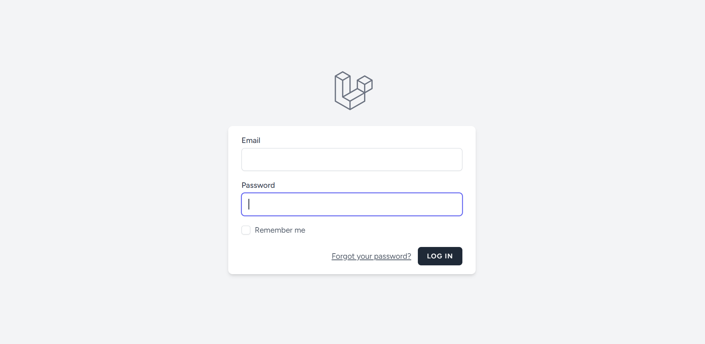
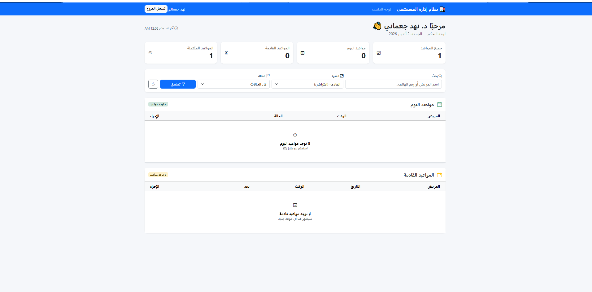
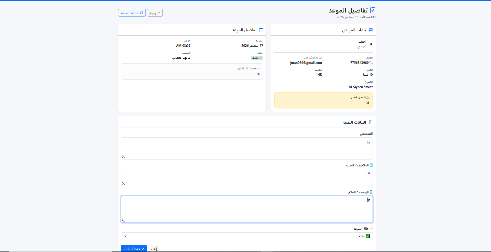
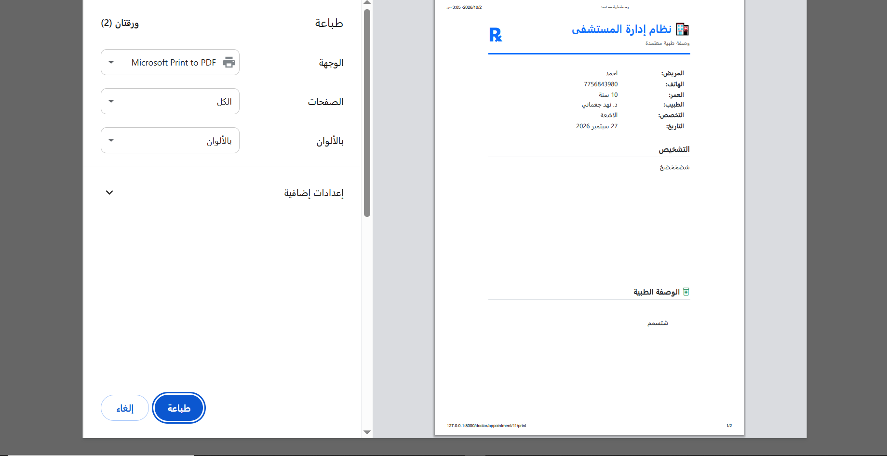
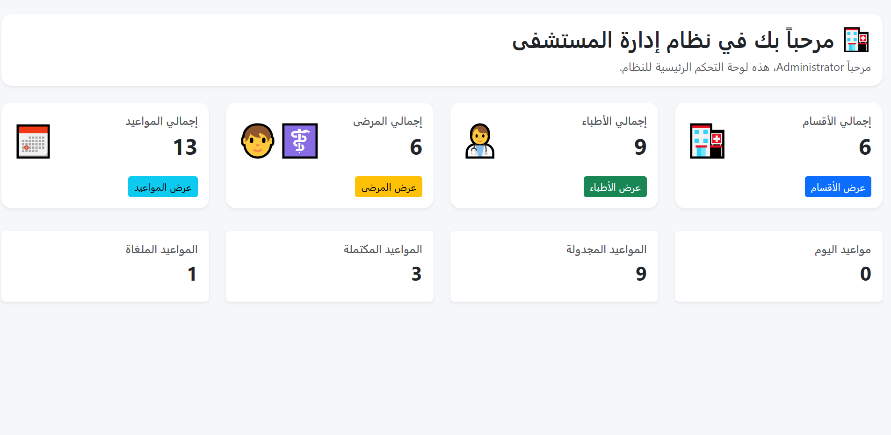
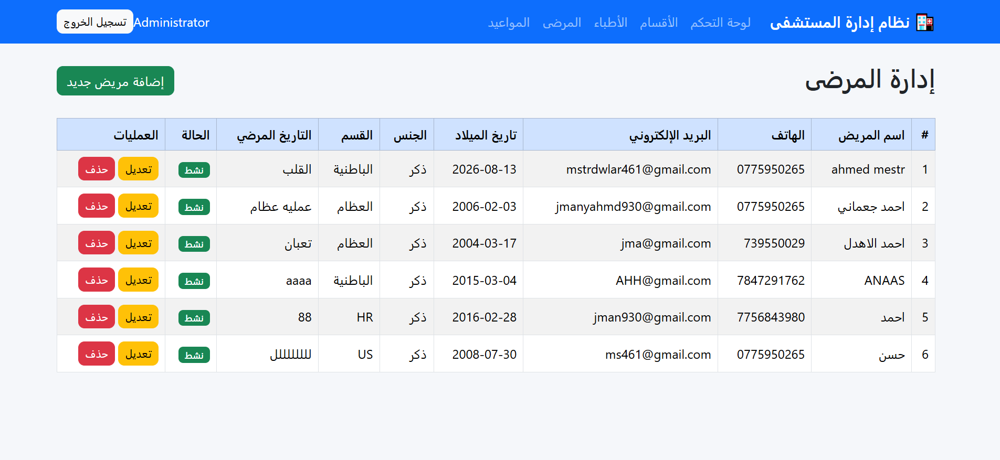
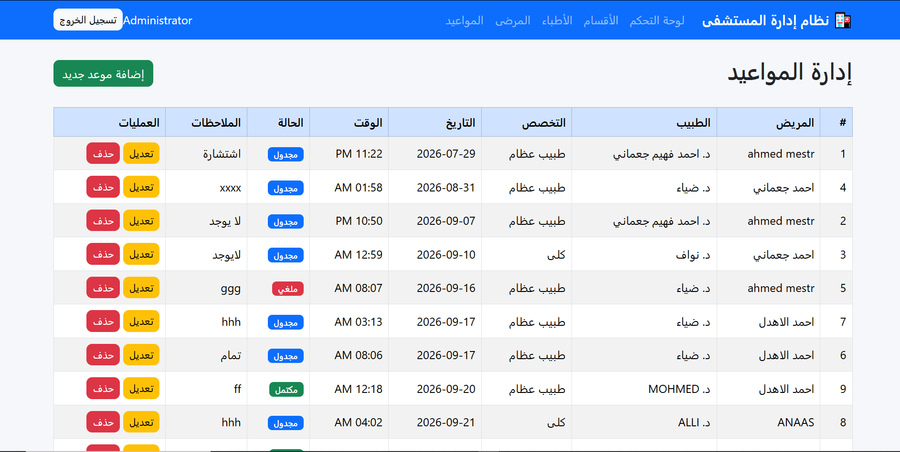
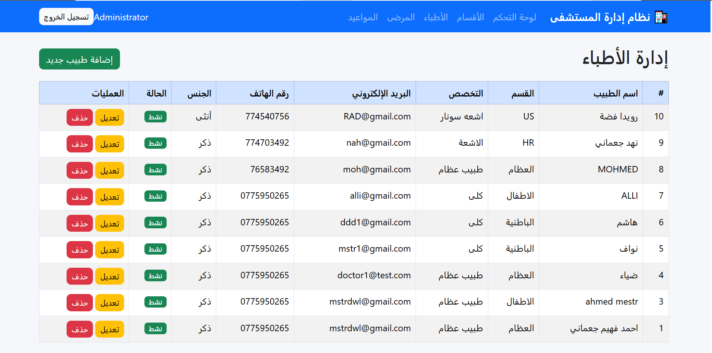

<div align="center">

# 🏥 Hospital Management System
# نظام إدارة المستشفى

نظام إدارة مستشفى احترافي مبني بـ **Laravel 11** و **Bootstrap 5**

[](https://laravel.com)
[](https://php.net)
[](https://getbootstrap.com)
[](https://mysql.com)
[](https://opensource.org/licenses/MIT)

</div>

---

## 📋 نبذة عن المشروع

**نظام إدارة المستشفى** هو تطبيق ويب متكامل يهدف إلى تسهيل إدارة العمليات اليومية في المستشفيات والعيادات، من خلال واجهات عصرية ونظام صلاحيات متعدد.

تم بناؤه باستخدام **Laravel 11** كـ Backend و **Bootstrap 5** كـ Frontend، مع دعم كامل للغة **العربية** و **RTL**.

---

## ✨ المميزات

### 🔐 نظام المصادقة والصلاحيات
- ✅ تسجيل دخول آمن (Laravel Breeze)
- ✅ ثلاثة أنواع من المستخدمين: **مدير** / **طبيب** / **موظف استقبال**
- ✅ Middleware مخصص لكل دور
- ✅ التحقق من صلاحيات الوصول لكل صفحة

### 👨‍⚕️ إدارة الأطباء
- ✅ إضافة / تعديل / حذف الأطباء
- ✅ ربط كل طبيب بقسم طبي
- ✅ ربط حساب المستخدم بملف الطبيب
- ✅ عرض بيانات التواصل والتخصص

### 🧑‍🦱 إدارة المرضى
- ✅ تسجيل بيانات المرضى الكاملة
- ✅ السجل الطبي لكل مريض
- ✅ البحث والفلترة
- ✅ ربط المريض بقسم طبي

### 📅 إدارة المواعيد
- ✅ حجز مواعيد بين المرضى والأطباء
- ✅ حالات متعددة: `مجدول` / `مكتمل` / `ملغي`
- ✅ منع تعارض المواعيد
- ✅ فلترة حسب الفترة والحالة

### 🩺 لوحة الطبيب
- ✅ عرض إحصائيات الطبيب
- ✅ جدول مواعيد اليوم
- ✅ المواعيد القادمة
- ✅ بحث بالاسم / الهاتف
- ✅ فلترة بالفترة والحالة

### 📝 السجلات الطبية
- ✅ تسجيل التشخيص لكل موعد
- ✅ كتابة الملاحظات الطبية
- ✅ كتابة الوصفة / العلاج
- ✅ عرض تاريخ زيارات المريض

### 🖨️ طباعة الوصفة الطبية
- ✅ صفحة طباعة احترافية بتصميم طبي
- ✅ رمز ℞ الطبي
- ✅ بيانات المريض والطبيب
- ✅ قابلة للطباعة أو الحفظ كـ PDF


## 📸 لقطات من المشروع

### 🔐 صفحة تسجيل الدخول


---

### 🩺 لوحة الطبيب


---

### 📋 تفاصيل الموعد


---

### 🖨️ طباعة الوصفة الطبية


---

### 📊 لوحة المدير


---

### 🧑‍🦱 إدارة المرضى


---

### 📅 إدارة المواعيد


---

### 👨‍⚕️ إدارة الأطباء


---

<div align="center">

⭐ **إذا أعجبك المشروع، لا تنسَ إضافة نجمة!** ⭐

</div>


---

## 🛠 التقنيات المستخدمة

| التقنية | الإصدار |
|---------|---------|
| Laravel | 11.x |
| PHP | 8.2+ |
| MySQL | 8.0+ |
| Bootstrap | 5.3 |
| Bootstrap Icons | 1.11 |
| Vite | 5.x |
| Tailwind CSS | 3.x |

---

## 📦 التثبيت

### المتطلبات
- PHP 8.2+
- Composer
- Node.js 18+
- MySQL 8.0+

### الخطوات

```bash
# 1. استنساخ المشروع
git clone https://github.com/ahmdjmany55-ctrl/hospital-management-system.git
cd hospital-management-system

# 2. تثبيت حزم PHP
composer install

# 3. تثبيت حزم Node
npm install

# 4. نسخ ملف البيئة
cp .env.example .env

# 5. توليد مفتاح التطبيق
php artisan key:generate

# 6. إعداد قاعدة البيانات في .env
# ثم:

# 7. تنفيذ الهجرات
php artisan migrate

# 8. بناء الأصول
npm run build

# 9. تشغيل السيرفر
php artisan serve
